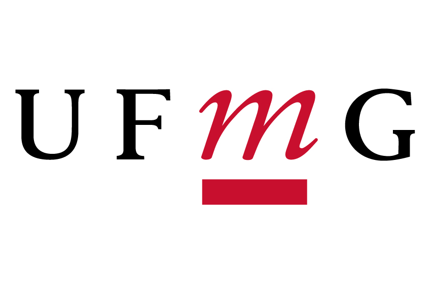

# Education

**[ 2019 - Current ]** Universidade Federal de Minas Gerais

Currently I'm doing a bachelor's degree in Electrical Engineering with emphasis on Computer Science.

 

**[ 2019 ]** freeCodeCamp

I did an online bootcamp with more than 1000 hours of study in Web Full-Stack development.

  

**[ 2015 - 2019 ]** Instituto Federal do Espírito Santo

I did a technical course about Mechanics.