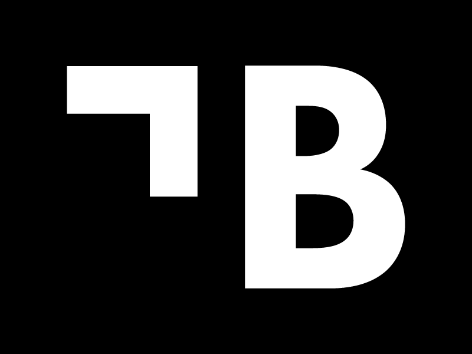

# Experiences

**[ 2021/07 - Current ]** [Letalk](https://letalk.com.br) ``(Tech Lead)``

In July of 2021, I started working at Letalk as a Tech Lead.

At this new position, I helped them and learned about `Webflow, Notification System, Application Perfomance, Google Chrome, Software Architecture, Kubernetes Taint/Toleration, Rancher Monitoring, Webhook, Queue Management, Application Scaling, Data Intensive Application, Code Review, Open Telemetry, Chatbot, Database Performance, AWS X-Ray, Datadog, Site Reliability Engineering`.

On top of that, it is important to know that I've `helped taking software design/architecture decisions on a notifications system integrated with external platforms, scaling and debugging Google Chrome crawling services backed by puppeteer, dealing with data intensive applications, dealing with resources performance - such as databases, scaling applications horizontally and vertically, optimizing code for performance, solving performance problems, helped reviewing code challenges during hiring processes, improved and optimized my process of navigating through different code bases while understading them fast, helped running a cluster of applications in a different group of nodes in the same kubernetes cluster, helped optimizing an api to handle a high number of webhook callings, helped creating a queue management system to deal with chat messaging, helped solving performance issues on node.js applications inside kubernetes, helped debugging node.js performance inside kubernetes, developing a chat bot application, improving database performance, helped debugging sql database queries, improving observability with telemetry resources like aws-xray and datadog`.

 

**[ 2021/03 - 2021/07 ]** [Bume](https://bume.com) ``(Tech Lead)``

In March of 2021, I started working at Bume as a Tech Lead.

At this new position, I helped them and learned about `Kubernetes, Rancher, AWS EKS, Puppeteer, Microservices, Socket, Software Scaling, Redis, Queues, Messaging System, Chatbot, Message Blasts, Kibana, Logging, Open Source, Tech Articles, React Componentization, React Global State Management, React Atomic State Update, Pair Programming`.

On top of that, it is important to know that I've `helped creating an attendance platform integrated with social medias, reviewing code, architecturing softwares, contributing with feedback about other developers, creating a microservice distributed system of high disponibility/scalability/availability integrated with whatsapp platform, architecturing an end to end chat bot application, creating a system log for microservice, creating a cluster manager service for slave microservices with socket, sharing knowledge by writing article, creating a global state management on react with atomic update/re-render for a chat messaging application, managing developer service credentials on aws, helping other developers to improve themselves`.

 

**[ 2020/08 - 2021/03 ]** [PICSIZE](https://picsize.com.br) ``(Tech Lead)``

In august of 2020, after completing almost 8 months of work as a developer, I've got invited to get a new position.

At this new position, I helped them and learned about `Software Architecture, Database Architecture, Code Review, Integration, ECS, Github Actions, Certbot, Nginx, Dealing with other department people, Talking to people, UX, EC2, ElasticSearch, Unit Tests, Integration Tests, Teaching, Data Analysis, AWS Costs`.

On top of that, it is important to know that I've `helped teaching new coworkers, reviewed lots of code, made a story (like instagram) creator white label app, helped taking software architectural decisions, created architectural templates, created a metrics system, helped solving an instance configuration mistake that was overloading all the platform processes/getting the platform down, helped architecturing tests implementation, taught other developers some stuffs I have experienced before, helped finding and decreasing possible cloud unnecessary costs`.

 

**[ 2019/12 - 2020/08 ]** [PICSIZE](https://picsize.com.br) ``(Full-stack Developer)``

In december of 2019, after completing almost 6 months of internship, I've got invited to get a new software developer position.

At this new position, I helped them and learned about `Software Project Management, Database Architecture, Cloud Infrastructure, Software Development, Software Architecture, Quality Assurance, Mentoring, ElasticSearch, LUA, Lightroom Plugins, Nunjucks, Server Side Rendering`.

On top of that, it is important to know that I've `created a queue system for picture uploads on front-end with retry and fallback delay features, solved a cloud infrastructure problem that was getting our upload system into lot of failures, made a lightroom plugin to integrate the adobe lightroom with our core application, took part of project requirements decision, mentored interns and stakeholders, headed code quality assurance with code reviewing and code refactoring, made a checkout page/application, made a compression file system to work with big sized files via serverless, helped decreasing infrastructure expenses, took part of infrastructure/technologies decision, made a platform for website creation`.

 

**[ 2019/06 - 2019/12 ]** [PICSIZE](https://picsize.com.br) ``(Full-stack Intern)``

That's a startup which has solutions for the photographer job flow, since the moment he finishes taking pictures till he delivers it to his clients. 

Even as a simple Intern, I was able to help them while learning from aws cloud architecture to software development in general, so I got in touch a lot with `AWS EC2, AWS S3, AWS SQS, AWS ElastiCache, AWS Lambda, AWS RDS, AWS CloudFront, GC Compute Engine, Redis, React, Redux, NodeJS, Styled Components, PostgreSQL, MongoDB, Grafana, MVC Architecture, Serverless Architecture and Event Driven Architecture`.

Besides, I had great realizations there, like, `refactored its landing page, created a distributed information system based on Redis, solved a bug that was making them lose clients everyday, found and helped solving a heavy database query that kept all the platform offline for almost 4 entire days, created a event oriented system, created a background processing application to work on side jobs such as mail sending and pictures processing, made a custom react hook for data validation/sanitization with help of back-end to improve user feedback, created a log system for some background processing jobs and picture uploads, made some data reports and headed a project to refactor all the platform back-end/front-end from their client to their api and background processing app while keeping in touch with senior developers`.

 

**[ 2019/02 - 2019/10 ]** [IBESVA](https://ibesva.netlify.com) ``(Front-end Developer)``

That's a Non-governmental organization that helps the education cause.

It was my first volunteering experience as a software developer. For the first time I was able to help people solving problems with programming, what made me fell in love with technology a little more and helped me getting into the professional road of Software Development.

As a starter at the world of programming, I've learned a lot about `HTML5, CSS3, jQuery and Adobe XD`.

As a volunteer, I `refactored their website design`.
