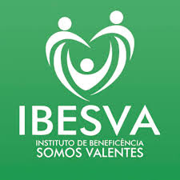

# Experiences

**[ 2019/12 - Current ]** [PICSIZE](https://picsize.com.br) ``(Full-stack Developer)``

In december of 2019, after completing almost 6 months of internship, I've got invited to get a new software developer position.

At this new position, I helped them and learned about `Software Project Management, Cloud Infrastructure, Software Development, Software Architecture, Quality Assurance, Mentoring, ElasticSearch, LUA, Nunjucks, Server Side Rendering`.

On top of that, it is important to know that I've `created a queue system for picture uploads on front-end with retry and fallback delay features, solved a cloud infrastructure problem that was getting our upload system into lot of failures, made a lightroom plugin to integrate the adobe lightroom with our core application, took part of project requirements decision, mentored interns and stakeholders, headed code quality assurance with code reviewing and code refactoring, made a checkout page/application, made a compression file system to work with big sized files via serverless, helped decreasing infrastructure expenses, took part of infrastructure/technologies decision, made a platform for website creation`.

 

**[ 2019/06 - 2019/12 ]** [PICSIZE](https://picsize.com.br) ``(Full-stack Intern)``

That's a startup which has solutions for the photographer job flow, since the moment he finishes taking pictures till he delivers it to his clients. 

Even as a simple Intern, I was able to help them while learning from aws cloud architecture to software development in general, so I got in touch a lot with `AWS EC2, AWS S3, AWS SQS, AWS ElastiCache, AWS Lambda, AWS RDS, AWS CloudFront, GC Compute Engine, Redis, React, Redux, NodeJS, Styled Components, PostgreSQL, MongoDB, Grafana, MVC Architecture, Serverless Architecture and Event Driven Architecture`.

Besides, I had great realizations there, like, `refactored its landing page, created a distributed information system based on Redis, solved a bug that was making them lose clients everyday, found and helped solving an architecture bug that kept all the platform offline for almost 4 entire days, created the event oriented microservices system, created a background processing application to work on side jobs such as mail sending and pictures processing, made a custom react hook for data validation/sanitization with help of back-end to improve user feedback, created a log system for some background processing jobs and picture uploads, made some data reports and headed a project to refactor all the platform back-end/front-end from their client to their api and background processing app while keeping in touch with senior developers`.

 

**[ 2019/02 - 2019/10 ]** [IBESVA](https://ibesva.netlify.com) ``(Front-end Developer)``

That's a Non-governmental organization that helps the education cause.

It was my first volunteering experience as a software developer. For the first time I was able to help people solving problems with programming, what made me fell in love with technology a little more and helped me getting into the professional road of Software Development.

As a starter at the world of programming, I've learned a lot about `HTML5, CSS3, jQuery and Adobe XD`.

As a volunteer, I `refactored their website design`.
