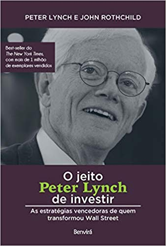

# O jeito Peter Lynch de investir

	

## Summary

This book was written by one of the most successful investors ever. He gives some tips that were really useful for him to make good investment decisions during the years.

## About stock price going down fear

Usually when people start investing, buying some stock options and after some days see their prices going down, starts to sell it and look for another stock options.

Lynch tell us that you don't have to worry about the prices going down (since you know why you have bought it), because if you buy 10 stock options and at least 6 of them get to the expected price, you'll probably make lots of profit.

## About buying new stock options

You just have to invest in stock options that you could handle to loose and this lost couldn't make any bad effect on your day-to-day life soon.

## About selling stock options

It is important to keep the stock with yourself while the company fundamentals (the ones that have driven your decision to buy it) have not change since you've bought it.

## About the market road

Lynch tells us about how the market works during the periods of high and low prices, comparing it to a cocktail party:

1. In the first stage, in the start of a ascendent market (a market which was in a down moment for some time and no one thinks it will get up again) the people does not event talk about stock options and if there's a investor on the party talking about what he does, people will get away from him.

2. In the second stage, some time has gone, the market improved 15%, people don't talk about stock options with anyone, neither with the investor already.

3. In the third stage, some time has gone again, the market improved 30%, people start talking about stock options with the investor, even looking for recommendations of what is good to be bought that time (at least one of the ones who are talking about it has invested on some stock option).

4. In the fourth stage, the people keep talking about stock options, but this time, instead of asking for recommendation, they are giving tips about what to buy and, if you feel like you worry about not have bought the stock the recommended stock options by them, it is a clear signal that the market is about to fall down.

## Useful tips

- Take advantage of what you already know
- Look for opportunities that weren't discovered already by the market
- Invest in companies, not in stock options
- Ignore the market price variation in the short term
- It is useless to predict the economy
- It is useless to predict the market short term
- The long term results are even more predictable and profitable than the ones of government bonds investment

## How to choose a stock option

At first, it is important to know that if you came across some stock option or have listened to people talking about it, it does not mean you have to buy it. Instead, take it as a start point to make some research about this stock option and in case you think that's a good one, you'll buy it.

At last but not least, you have to make the same effort you make to buy food and things you like in buying stock options. There are different ones and there's no limit for the profit they can give you.

Below you can see the steps you can be based at in order to make a history about the stock option in order to help you deciding to buy it or not:

1. If you're going to choose a stock option based only in the power of a single product it sells, the first thing you need to discover is: What effect does this product make in the final brand result?

2. Now, it is time to understand what is the size of the brand. 

> Usually there are two kinda sizes when we talk about brands:
>
> **1. Small:** Generally brands there are small in the market they work
>
> **2. Big:** Generally brands there are big in the market they work
>
> It is important to you to be minded that it is mathematically impossible to a big brand to get more profits than a small one in the short term.

3. After deciding the size of the brand, it is important to understand what is the kinda growth it has.

> At first, when we talk about growth, we're saying that a brand is expanding, selling more, making more products, getting more profits year by year. Generally the individual growth can be measured by the PIB Growth compared to the Brand Growth.
>
> There are three growth types and three general types in which we can find a brand at:
>
> **1. Slow:** Big brands well stablished that grow in the same level of its country PIB [~4% per year] (generally they were growing fast in the past but reached a limit or something like that) and usually they pay good profits to its investors (since they don't know where to spend money).
>
> **2. Reliable:** Big brands well stablished that are really needed by people (Per example the brands that make food. Ex: Kellogs - They sell chips, everyone is addicted to chips and if a recession occurs, people will keep on buying it since it is cheaper than other foods) and grow above its country PIB [~12% per year].
>
> **3. Fast:** New and small brands that grow a lot more than its country PIB [~25% per year] (they can still grow a lot in a market of big and slowed growth brands. It is important to look for the ones with good balanced prices and that are gaining substantial profits. The tip here is to know when they will stop growing and how much to pay for its growth).
>
> **4. Cyclic:** Their profits and selling increase and decrease regularly during periods of the year. The tip here is to buy it during the final of decrease time and start of increase time.
>
> **5. Recover:** These are the brands that don't even grow (since they got hurt by something really bad). The really good news about it, is that they usually have a chance to make a turnover and grow way too much. The tip here is to analyse this stock in a non passionate way and avoid ruin risk.
>
> **6. Hidden stock options:** Usually the brands that have financial assets ignored by the Wall Street (Per example a brand that its stock options cost $1.20 but it owns lots of shoppings that for sure make its stock option price to be 10 times higher than it is sold on Wall Street).

4. Now it is time to check if the brand fits in some traits:

> Usually we'll be looking for easy to understand business and undiscovered good brands, since it is easier to get in touch with it through the days and to make a good profit. With that in mind, we can check if a brand fits in some of the 13 traits we believe that belong to the perfect brand.
>
> **1. The business looks damn:** The business is way too much easy to understand and extremely tedious that look like everyone could own it.
>
> **2. The brand works with damn stuff:** The brand works with really tedious and damn stuff (generally common stuffs, like making cans).
>
> **3. The brand works with disgusting stuff:** The brand works with disgusting stuff that almost make people to barf when they see it.
>
> **4. The brand is result of a company spin-off:** Generally after a spin-off, the new brands receive a new head to own it and make it works the right way (slowing down costs, etc).
>
> **5. The financial institutions are not owners of it and the analysts does not get in touch with it:** With these brands you're probably be able to buy it cheaper than it really is, before other people notice it is a good brand and it grows.
>
> **6. The bad famous looks to never stop growing:** That's another opportunity to buy the brand since it is cheap because of the bad famous people are making about it.
>
> **7. The brand works with depressing stuff:** The brand work stuff that are not disgusting, but are depressing (per example, has graveyards, sells coffins, etc).
>
> **8. The brand is inside a business of no growth:** Usually these brands will grow no matter what even if it takes lot of time.
>
> **9. The brand owns a niche:** Usually these brands has no rival on the place it lives and so, they're probably the only brand working with this stuff in that place.
>
> **10. The people can't live without the stuff the brand makes:** The brand makes stuff that the people are not capable of living without it. Basically it means that people will keep on buying and giving money for a long time for this brand.
>
> **11. The brand uses technology:** Since the brand uses technology, it is able to decrease expenses, grow up production, etc, everything needed to help it growing fast and well.
>
> **12. People that are engaged in the brand buy its stock options:** We call it 'Skin in the game', basically people that are leading the brand invests their money on it, what means they believe on the business and are really willing to make it to grow.
>
> **13. The brand are buying its own stock options:** When the brand are buying its own stock options, it is making to exist less of its own stock options around the world and so, making the stock option price more expensive (basically rewarding the people who buy it)

5. And so check if the brand fits in some threats you need to avoid (or follow it as a simple warning that this brand can be harmful for you):
> **1. People say this brand will be the next something:** Some people usually say that a brand will be the next brand that does something good. Ex: This brand will be the next McDonald's.
>
> **2. Brands that prioritize wrong stuffs:** Usually some brands prioritize acquiring other stuffs rather than buying new stock options and so on. The bad thing here is that they usually acquire bad stuffs.
>
> **3. The whispered brands:** These are the brands that are usually known by you when someone whisper its name to you like it is a really good brand that no one knows anything about it.
>
> **4. The brand with a single intermediate:** Usually that are brands that sell stuff to a single buyer, and it is not possible to know if this single buyer will stop buying it or not. So, try to avoid these ones.
>
> **5. Brands with interesting names:** Some brands will be famous only by the name it has, so worry about them. 

6. Give a little look at a graphic of Stock Price x Profit
> **1. If the stock price line is lower than profit price line, it is possible that the stock price is underrated:** You'll probably pay less for it, since it can get higher soon.
>
> **2. If the stock price line is higher than profit price line, it is possible that the stock price is overrated:** You'll probably lose some money, since in can get slower soon.

7. Now it is time to get some information about the brand's P/L
> At first, P/L is basically the stock option price divided by its profits in the last year. Per example:
>
> A brand with a stock option that costs $35 that has had a profit of $3,50 per stock option in the last 12 months has a P/L of 10, what means that you will have your invested money back in 10 years if the stock option price stay constant.
>
> Usually the P/L is low for brands of fast growth and high for brands of slow growth. The ciclic ones are inserted between these two ones.
>
> Besides, the P/L can change from a brand ecosystem to another. Last but not least, keep in mind that this can be tricky since some brands of fast growth can have a big P/L as well.

8. Now we need learn as much as we can about what the brand is making in order to grow and prospect, even everything that is good for it.

> Before being able to buy a stock option, it is recommended that you can tell in 2 minutes about what the brand need to make to succeed and what will be a treat for it. You need to do that in a way that even a child can understand what you're saying.
>
> Some important topics to talk about:
>
> 1. If you're trying to buy a slow brand growth, you're probably doing that to get some dividends, then it could look like that:
> - Why am i buying that?
> - This brand has grown its profits consecutively in the last 10 years and offers a great dividend, never stopped paying dividends during bad or good moments. It is a SasS and the new buying they're doing can really improve their growth.
>
> 2. If it is a cyclic brand it could look like that:
> - What about the business, stock and prices?
> - The market of this brand has been stuck for the last 3 years but this year it increased. I know it because the car selling increased a lot in the last 18 months, the brand closed 5 inefficient manufacturers, cut costs and the profit increased.
>
> 3. A brand with hidden acquiring could be like:
> - What about the acquisitions and how much they cost?
> - The stock option is sold for $8 but only the videogames costs around $4 per stock option and the houses $7, so I'm buying the rest of the brand for less $3. The brand has constant profits and there are no debts.
>
> 4. The brand in recover could look like:
> - What are they doing to get better and is it working till now?
> - The General Mills has done a great progress by changing her priority. She came from 11 manufactures to only 3. When selling Eddie Bouer, the General Mills started over doing what she is good at: Getting into the restaurant and foods ecosystem. They will launch a new product and their profit are increasing a lot.
>
> 5. The reliable brand:
> - What is the P/L and if it grown a lot in the last months, what they did to make it?
> - The Coca-Cola is sold for the most cheap price of its P/L graphic. Its stock options are stable for almost 2 years. They've sold half of its houses, the consume of Coca-Cola has increased about 30% in the last year. Because of that, they really can get better than everyone expect to.
>
> 6. Fast growth brand:
> - Where and how will it grow fast as possible?
> - The La Quinta is a mix of real states that started its operations on Texas. The brand has grown a lot in other two regions by doing the same successful recipe, the profit has grown a lot in the last months. The real state ecosystem has a really slow growth but the La Quinta has found a good niche to go in before saturating on it.

9. Another good questions to answer before buying a stock option:
> How is this stock options classified? (Ex: fast growth)
> How much they've grown in terms of profit?
> How its P/L value looks like when compared to its historic values?
> Why is it good to buy it now?
> How its market looks like right now?
> What about their profits?
> What about their debts?
> How they will finance its growth without selling stocks and cutting profits?
> The stakeholders are buying the stock options?
> How the graphic of Stock Option Price x Profits in the last 5 years looks like?
> What about the dividends? Are they always paid?
> How much stock options are owned by financial institutions?

10. Now it is time to understand the stock option reports.
